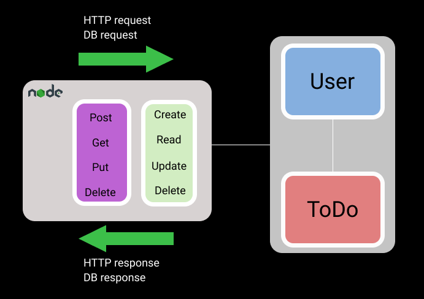

# Session 2 - ExpressJS




## Instructions
1) Run `npm init` in the [WorkFolder](./) terminal
2) Install ExpressJS(express) from npm
3) Install dotenv from npm
4) If you want to run es6 modules set `"type":"module"`in `package.json`, otherwiseyou have to run CommonJS(require) module loading
5) Import installed modules
6) Initialize express by declaring `const app = express()`
7) Create a `.env` file with a port variable set. 
8) Create an endpoint that responds to a `todo` `GET` request
```js
app.get("/todo",(req,res)=>{
res.send({name:"MyToDo",status:"NEW"})
})
```
9) Run `app.listen(process.env.port)`
10) Open yoour browser and test your endpoint [localhost](http://localhost:8080/todo)